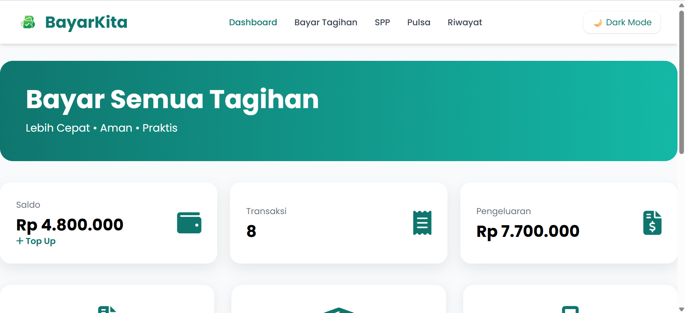
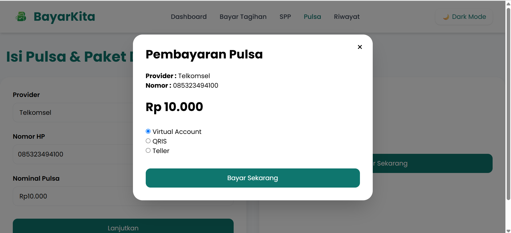
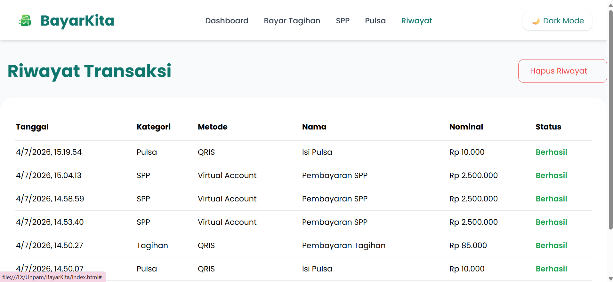
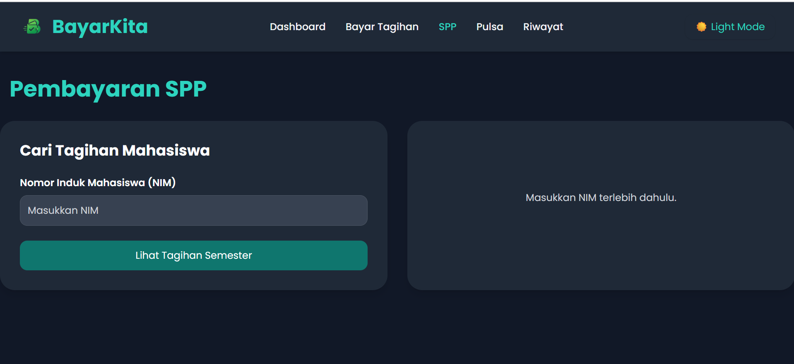

# BayarKita adalah aplikasi pembayaran digital berbasis web yang dibangun menggunakan HTML, CSS (Tailwind CSS), dan JavaScript. Aplikasi ini mensimulasikan berbagai jenis pembayaran seperti Tagihan, SPP, dan Pulsa dengan beberapa metode pembayaran.

## Dashboard

## Payment

## History

## Dark-mode

## Fitur

- Dashboard interaktif
- Pembayaran Tagihan
  - PLN
  - PDAM
  - Internet
  - Seminar
- Pembayaran SPP
- Pembelian Pulsa
- Virtual Account
- QRIS
- Teller
- Riwayat Transaksi
- Bukti Pembayaran
- Export PDF
- Print Receipt
- Dark Mode
- Grafik Statistik Pembayaran
- Simulasi Saldo
- Top Up Saldo
- LocalStorage

# Aplikasi BayarKita menggunakan data dummy sebagai simulasi transaksi.

PLN
| Nomor Pelanggan | Nama |
|-----------------|----------------|
| 123456789012 | Budi Santoso |
| 234567890123 | Siti Aminah |
| 345678901234 | Andi Saputra |
| 456789012345 | Rina Wulandari |
| 567890123456 | Dedi Kurniawan |

PDAM
| Nomor Pelanggan | Nama |
|-----------------|----------------|
| 111122223333 | Ahmad Rizki |
| 444455556666 | Nina Lestari |
| 777788889999 | Rudi Hartono |

Internet
| Nomor Pelanggan | Provider |
|-----------------|----------------|
| INET001 | IndiHome |
| INET002 | Biznet |
| INET003 | First Media |

Seminar
| Kode Seminar | Nama Seminar |
|--------------|----------------|
| SEM001 | Seminar AI 2026 |
| SEM002 | Web Development |

SPP
| NIM | Nama Mahasiswa |
|-------------|----------------|
| 221011450017 | Siti Marlina |
| 202310002 | Budi Santoso |
| 202310003 | Andi Saputra |

Seluruh data di atas merupakan data simulasi (dummy) yang digunakan untuk demonstrasi dan pengujian fitur aplikasi.

## Repository

https://github.com/Sitimarlina285/BayarKita

## Live Demo

https://sitimarlina285.github.io/BayarKita/
